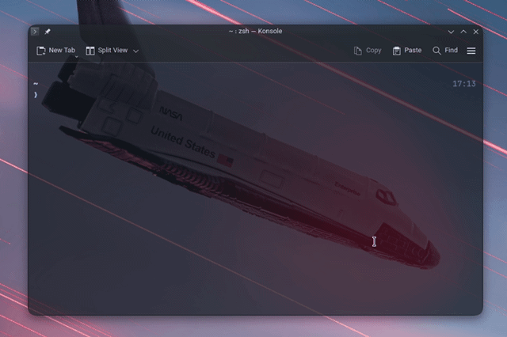
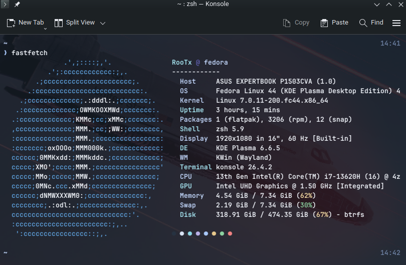
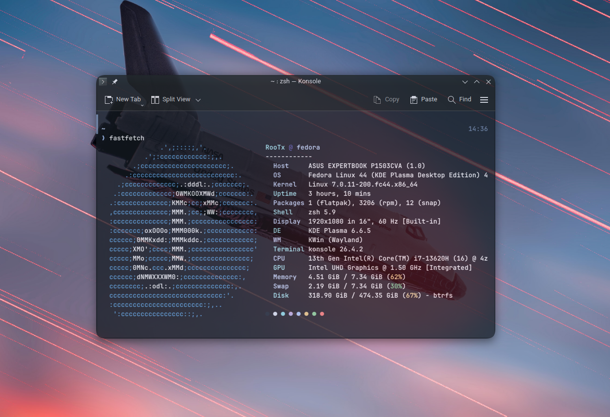

# Darky-Plasma
A clean terminal environment for KDE Plasma (Zsh / Bash)


## Preview

> Supports Arch Linux, Arch-Based, Fedora, and RHEL-Based Distributions.
> ---------------------------------------------------------






## Installation
> Supports: Arch Linux, Arch-Based, Fedora, and RHEL-Based Distributions


> Recommended: `chmod +x install.sh && ./install.sh`

### 1. Install Font 
```bash
#Fedora / RHEL-based
sudo dnf install jetbrains-mono-fonts-all

#Arch
sudo pacman -S ttf-jetbrains-mono
```
### 2. Konsole Theme
```bash
# Copy config files

cp DarkySlate.colorscheme ~/.local/share/konsole
cp Darky.profile ~/.local/share/konsole

# In Konsole: Settings → Manage Profiles → Import
# Or set default: Settings → Edit Current Profile → Darky
```
### 3. Fastfetch
```bash
# Install Fastfetch
# Fedora / RHEL-based
sudo dnf install fastfetch

#Arch
sudo pacman -S fastfetch

# Copy config file
mkdir -p ~/.config/fastfetch
cp config.jsonc ~/.config/fastfetch/
```
> For other distros, change `"source": "Fedora"` in config.jsonc to your distro name

### 4. Starship
```bash
# Install
curl -sS https://starship.rs/install.sh | sh

# Copy config
cp starship.toml ~/.config/starship.toml

# For Zsh
echo 'eval "$(starship init zsh)"' >> ~/.zshrc

# For Bash
echo 'eval "$(starship init bash)"' >> ~/.bashrc

```

## License
MIT
